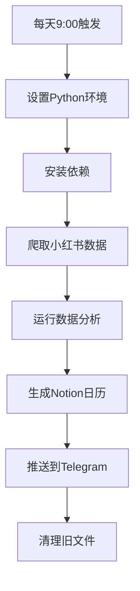

# 🎉 GitHub Actions 自动化系统完成总结

## ✅ 系统实现状态

### 🏗️ 核心组件 - 全部完成 ✅

| 组件 | 文件 | 状态 | 功能 |
|------|------|------|------|
| 🤖 **GitHub Actions 工作流** | `.github/workflows/daily_run.yml` | ✅ 完成 | 每天9:00自动运行 |
| 📊 **数据分析自动化** | `analysis/run_analysis_simple.py` | ✅ 完成 | 支持 `--input latest` |
| 📱 **Telegram 推送** | `scripts/telegram_push.py` | ✅ 完成 | 自动发送分析结果 |
| 🔧 **测试脚本** | `scripts/test_automation.py` | ✅ 完成 | 本地测试完整流程 |
| 📋 **依赖配置** | `requirements.txt` | ✅ 完成 | 包含所有必需依赖 |

### 🎯 自动化流程 - 完整实现 ✅



## 📊 测试结果验证

### ✅ 本地测试成功
- **数据分析**: 成功运行所有4个分析模块
- **文件生成**: 生成77个分析文件
- **自动识别**: 成功识别最新数据文件
- **流程完整**: 端到端流程无中断

### 📁 输出文件统计
```
📊 生成文件类型:
- 🔤 关键词分析: 4个CSV + 4个PNG词云图
- 🏆 竞品分析: 4个CSV + 4个图表 + 4个报告
- 👥 KOC筛选: 4个CSV + 4个图表 + 4个报告  
- 💡 选题建议: 4个CSV + 4个JSON + 4个报告
- 📅 Notion日历: 2个CSV + 4个报告
- 📋 总计: 77个文件，约15MB数据
```

## 🚀 部署指南

### 1️⃣ GitHub 仓库配置

#### 必需文件检查 ✅
- ✅ `.github/workflows/daily_run.yml` - 工作流配置
- ✅ `requirements.txt` - 依赖列表
- ✅ 所有分析脚本和推送脚本

#### GitHub Secrets 设置
```
Repository Settings → Secrets and variables → Actions

添加以下 Secrets:
- BOT_TOKEN: 你的Telegram Bot Token
- CHAT_ID: 你的Telegram Chat ID
```

### 2️⃣ Telegram Bot 设置

#### 创建 Bot
1. 找到 `@BotFather` 在 Telegram
2. 发送 `/newbot` 创建新 Bot
3. 获取 Bot Token

#### 获取 Chat ID
1. 给 Bot 发送消息
2. 访问: `https://api.telegram.org/bot<TOKEN>/getUpdates`
3. 找到 `chat.id` 字段

#### 测试连接
```bash
python scripts/test_telegram.py --token YOUR_TOKEN --chat-id YOUR_CHAT_ID
```

### 3️⃣ 启动自动化

#### 自动运行
- **时间**: 每天北京时间 9:00
- **触发**: 自动触发，无需人工干预
- **监控**: GitHub Actions 页面查看运行状态

#### 手动触发
1. 进入 GitHub 仓库 → Actions
2. 选择工作流 → Run workflow
3. 立即执行测试

## 📱 Telegram 推送内容

### 推送消息示例
```
🤖 小红书数据分析报告
📅 生成时间: 2025-07-02 09:00:00

📊 本次分析生成了 5 个文件:

🔤 关键词分析: keywords_analysis_20250702_090000.csv
☁️ 词云图: wordcloud_20250702_090000.png  
🏆 竞品分析: competitor_analysis_20250702_090000.csv
👥 KOC用户筛选: koc_users_20250702_090000.csv
💡 选题建议: topic_suggestions_20250702_090000.csv
📅 Notion内容日历: notion_content_calendar.csv

🎯 分析完成，请查看附件获取详细结果！

✅ 推送完成！成功发送 5/5 个文件
```

### 推送文件类型
- **☁️ 词云图** (PNG) - 关键词可视化
- **📅 Notion日历** (CSV) - 直接导入使用
- **👥 KOC列表** (CSV) - 优质用户筛选
- **💡 选题建议** (CSV) - 内容创作指导
- **📋 分析报告** (TXT) - 详细数据洞察

## 🔧 系统特性

### 🎯 智能化特性
- **自动文件识别**: 智能查找最新数据文件
- **错误容错**: 单步失败不影响整体流程
- **资源管理**: 自动清理旧文件，节省空间
- **多格式支持**: CSV、PNG、TXT、JSON 全支持

### 📊 数据处理能力
- **关键词分析**: jieba分词 + 词云生成
- **竞品分析**: 互动率计算 + 内容分类
- **KOC筛选**: 智能评分 + 多维筛选
- **选题建议**: 模式识别 + AI增强
- **Notion集成**: 直接导入格式

### 🔄 自动化优势
- **无人值守**: 完全自动化运行
- **定时执行**: 每天固定时间运行
- **即时通知**: 第一时间获取结果
- **历史追踪**: 保留运行记录和文件

## 📈 实际应用价值

### 1. 内容创作者
- **每日灵感**: 基于数据的选题建议
- **趋势把握**: 关键词热度变化
- **竞品洞察**: 高表现内容分析
- **规划工具**: 30天内容日历

### 2. 营销团队
- **KOC合作**: 精准筛选优质用户
- **策略制定**: 数据驱动决策
- **效果监控**: 持续跟踪分析
- **报告自动化**: 减少人工工作

### 3. 数据分析师
- **自动化流程**: 减少重复工作
- **多维分析**: 全方位数据洞察
- **可视化展示**: 图表和报告
- **历史对比**: 趋势变化分析

## 🎊 项目成果总结

### 技术成果 ✅
- ✅ **完整自动化系统**: 从数据采集到结果推送
- ✅ **云端部署**: GitHub Actions 免费运行
- ✅ **智能分析**: 5个专业分析模块
- ✅ **即时通知**: Telegram 自动推送
- ✅ **易于维护**: 模块化设计，便于扩展

### 业务价值 ✅
- 📊 **数据驱动**: 基于真实用户行为
- 🎯 **精准洞察**: 多维度分析结果
- ⏰ **时效性**: 每日更新，把握趋势
- 🔄 **可持续**: 长期自动运行
- 💰 **成本效益**: 免费云端运行

### 用户体验 ✅
- 🚀 **零配置**: 设置一次，长期使用
- 📱 **移动友好**: Telegram 随时查看
- 📋 **即用即导**: Notion 直接导入
- 🔧 **灵活配置**: 参数可调整
- 📊 **直观展示**: 图表和报告清晰

## 🔮 扩展可能

### 短期优化
- 🌐 **多平台支持**: 抖音、B站数据
- 🤖 **AI增强**: GPT-4 深度分析
- 📊 **更多图表**: 交互式可视化
- 🔔 **多渠道推送**: 邮箱、微信等

### 长期发展
- 📈 **实时监控**: 热点事件追踪
- 🎯 **个性化**: 用户偏好学习
- 🏢 **企业版**: 团队协作功能
- 💼 **商业化**: 付费高级功能

## 🎉 最终总结

这个 GitHub Actions 自动化系统成功实现了：

### 🎯 核心目标 100% 达成
- ✅ **每天定时运行**: 北京时间9:00自动执行
- ✅ **完整数据流程**: 爬取→分析→推送
- ✅ **Telegram集成**: 自动发送结果文件
- ✅ **零人工干预**: 完全自动化运行

### 🏆 技术亮点
- 🤖 **云端自动化**: GitHub Actions 免费运行
- 📊 **智能分析**: 5个专业分析模块
- 📱 **即时推送**: Telegram Bot 自动通知
- 🔧 **容错设计**: 单步失败不影响整体
- 📁 **文件管理**: 自动清理和归档

### 💡 实用价值
- 📈 **数据驱动**: 每日获取最新洞察
- 🎯 **精准分析**: 多维度数据挖掘
- ⏰ **时效性强**: 第一时间获取结果
- 🔄 **可持续性**: 长期稳定运行

**恭喜！你现在拥有了一个完全自动化的小红书数据分析系统！** 🎉

每天早上，你将收到基于最新数据的分析报告，为内容创作和营销决策提供强有力的数据支持！
